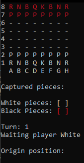
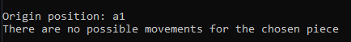
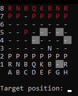
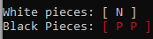

# Projeto_Xadrez_Console
 Projeto de Xadrez, do Curso C# + POO - Professor Nelio alves

 Parte 1: Desenvolver jogo de xadrez com todas as regras e comandos. - Rodando via Console (finalizado);

 

 

 Legenda:  
 K = King = Rei 
 Q = Queen = Rainha 
 B = Bishop = Bispo 
 N = Knight = Cavalo 
 R = Rook = Torre 
 P = Pawn = Peão 

 

### Caso selecione uma peça sem movimento possível (Tratativa de erro)

 
 

### Indicação de movimentos possíveis

 
 

### Estoques de peças retiradas

 
 

### Estoques de peças retiradas

 
 

   
 Parte 2: Modificar para permitir funcionamento via API e conexão com Frontend (ampliando conhecimentos para resolver);

 Parte 3: Criar testes de integração e unitários;